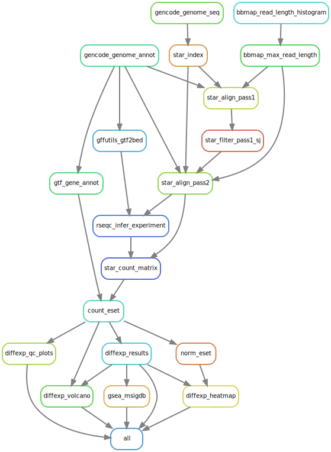

# rna-seq-star-gex

STAR + edgeR/DESeq2/limma-voom RNA-seq gene expression analysis Snakemake
workflow. Uses [fastp](https://github.com/OpenGene/fastp) for QC and trimming
and [GENCODE](https://www.gencodegenes.org/) for the reference genome and
annotations. It currently supports two group experimental conditions, but could
easily be extended to support more complex experimental designs and contrast
matrices.

Snakemake workflow rule graph below. For some reason with the latest version of
Snakemake the `fastp_trim_fastq` rule isn't showing up in the rule graph
because I a function with `unpack` to get raw and trimmed FASTQ inputs.

