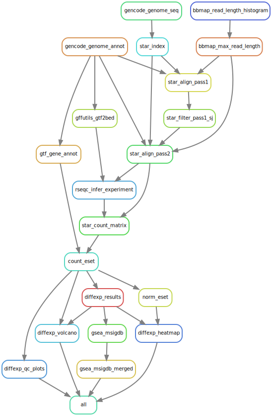

# STAR + edgeR/DESeq2/limma-voom + GSEA RNA-seq gene expression analysis workflow

Uses [fastp](https://github.com/OpenGene/fastp) for FASTQ QC and trimming
and [GENCODE](https://www.gencodegenes.org/) reference genome and annotations.
It currently supports two-group experimental conditions, but could be extended
to support more complex experimental designs and contrast matrices.

Requires [Mamba/Conda](https://github.com/conda-forge/miniforge#mambaforge).
Create and activate the workflow conda environment (which provides `snakemake`):

```bash
mamba env create -f envs/rna-seq-star-gex.yaml
mamba activate rna-seq-star-gex
```

Edit [config.yaml](config/config.yaml), [samples.tsv](config/samples.tsv),
and [units.tsv](config/units.tsv) with the study config and sample and data
info.

Run the workflow:

```bash
snakemake --use-conda --cores all --resources gencode_download_jobs=2
```

Snakemake workflow rule graph shown below. For some reason with the latest
version of Snakemake the `fastp_trim_fastq` workflow rule isn't showing up in
the rule graph because I use a function with `unpack` to get raw and trimmed
FASTQ inputs.


